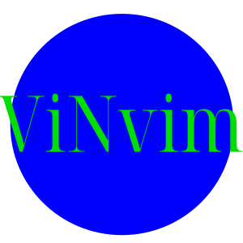
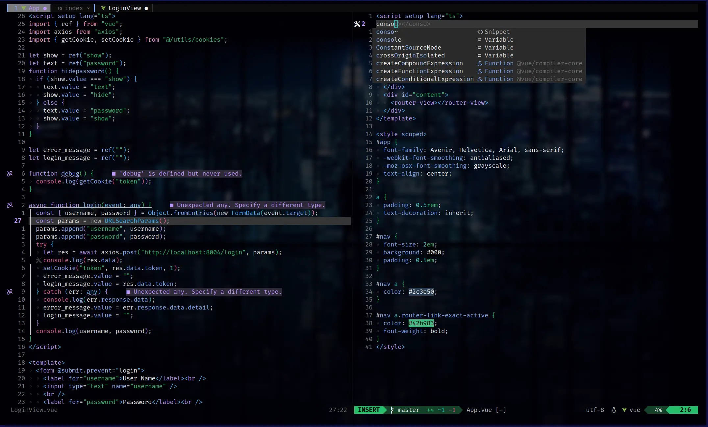
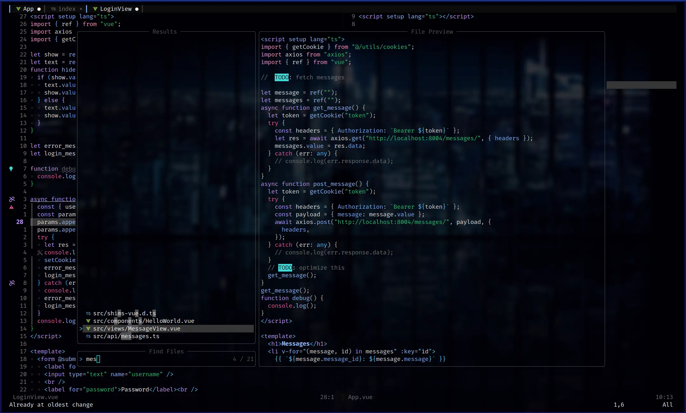

---
# About

My personal nvim configuration. Contains file finder, autocompletion, autoformat, snippets, debugger.\
Has been use for the following languages **HTML, CSS, JS, Python, Bash, Terraform, Go, C, Java**.

---
# Showcase

### Autocompletion

### Find File

